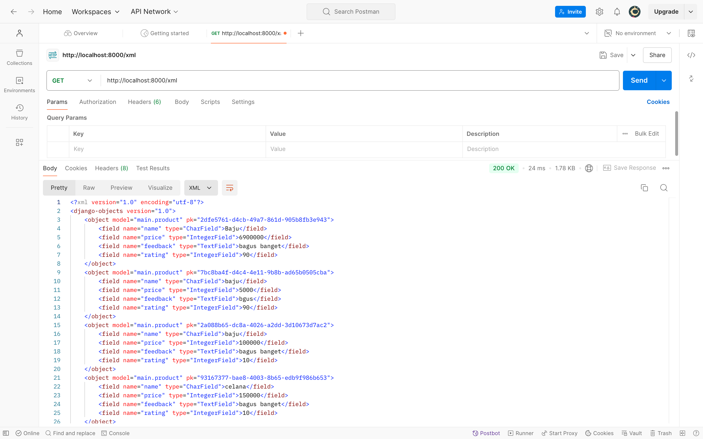
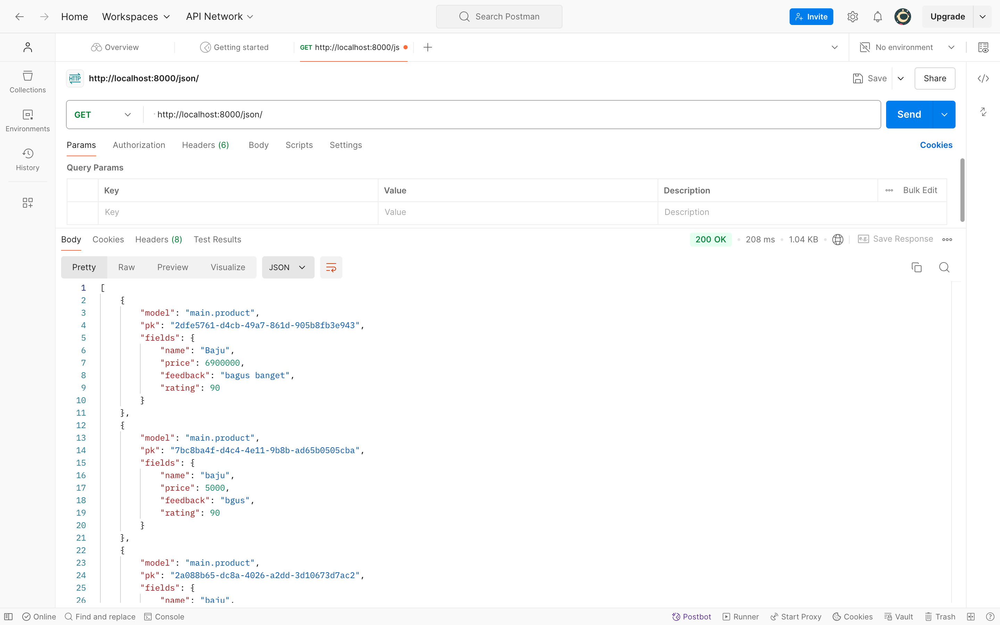
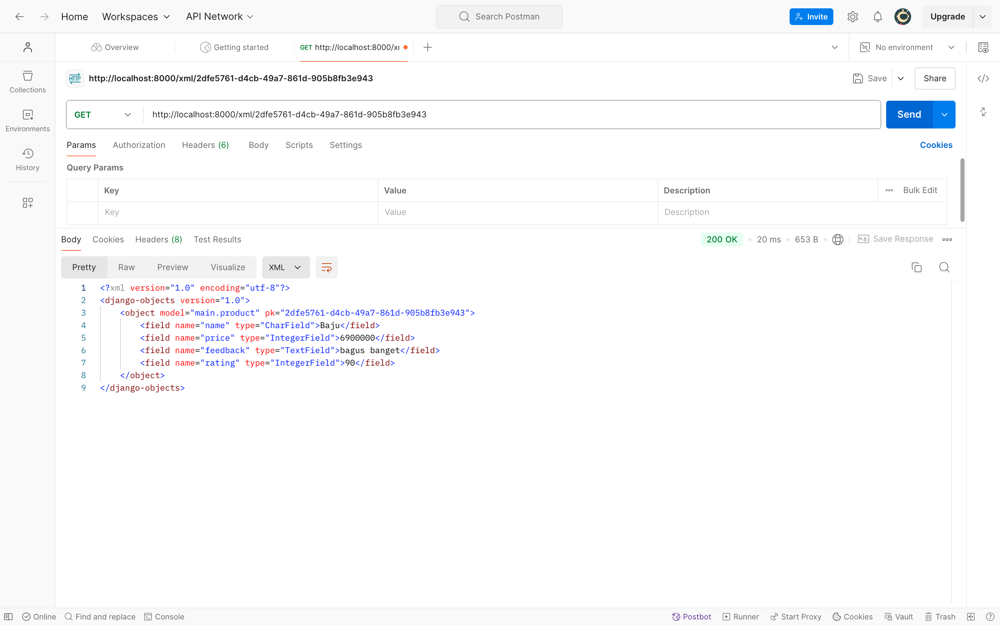
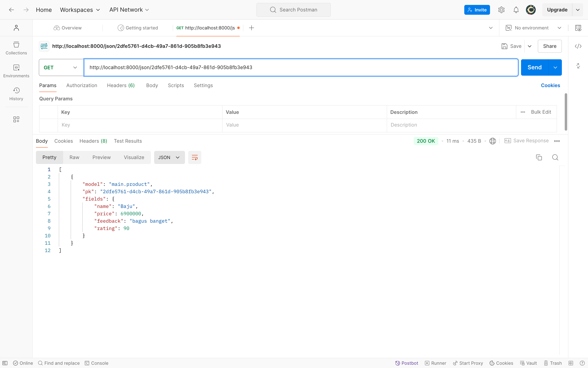

**Maira Shasmeen Mazaya 2306245724**

# Tugas 2 PBP

 **1. Tautan menuju aplikasi PWS = http://maira-shasmeen-shtoree.pbp.cs.ui.ac.id**

 **2. Jelaskan bagaimana cara kamu mengimplementasikan checklist di atas secara step-by-step :**
 - Pertama, saya membuat direktori baru dengan nama 'Shtoree' (tema aplikasi saya adalah e-commerce clothing brand).
 - Setelah itu, saya mengatur Django dengan mengaktifkan virtual environment, menyiapkan dependencies dengan membuat berkas `requirements.txt`, menginstal dependencies dan membuat proyek dengan nama shtoree dengan perintah: 
 ```bash
    pip install -r requirements.txt
   django-admin startproject shtoree .
 ```
 juga memodifikasi file `settings.py`.
 - Lalu, saya membuat repo baru di Github dengan nama shtoree dan menghubungkannya dengan direktori lokal menggunakan perintah:
 ```bash
 git branch -M main
  git remote add origin https://github.com/maira-shasmeen/shtoree.git
 ```
 - Kemudian, saya menambahkan file `.gitignore` untuk mengabaikan file yang tidak perlu disimpan di Git dan melakukan add, commit, dan push dari direktori repositori lokal.
 - Dilanjutkan dengan membuka PWS untuk membuat project baru. Saya memodifikasi file settings.py dengan menambahkan URL deployment PWS saya (maira-shasmeen-shtoree.pbp.cs.ui.ac.id) dan melakukan langkah-langkah deployment PWS seperti yang diajarkan di tutorial.
 - Selanjutnya, saya membuat aplikasi Django menggunakan perintah:
 ```bash
 python manage.py startapp main
 ```
 dan membuat routing dan persiapan lainnya yang dijelaskan di Tutorial 1. Membuat folder templates di dalam folder main untuk membuat template lalu tambahkan file main.html.
 - Setelah itu, saya membuat model pada aplikasi `main` dengan nama `Product`, yang berisi atribut-atribut:
   - name (CharField)
   - price (IntegerField)
   - description` (TextField)
   - size (CharField)
 - Lalu, saya buat fungsi di `views.py`dia mengambil data dari model dan mengirimkan ke template untuk ditampilkan, variabel yang saya gunakan antara lain:
    - 'nama_aplikasi'
    - 'nama_mahasiswa'
    - 'nama_kelas'
    - 'name' : nama produk
    - 'price' : harga produk
    - 'description': deskripsi produk
    - 'size': ukuran produk
  - Setelah itu, saya memodifikasi file `main.html` dengan Menambahkan judul, nama aplikasi, nama mahasiswa, kelas, foto,  juga deskripsi produk yang diambil dari variabel di `views.py`.
 - Setelah selesai, saya melakukan push ke PWS dengan perintah berikut:
 ```bash
   git push pws main:master
 ```
 - Setelah berhasil, websitenya bisa diakses di http://maira-shasmeen-shtoree.pbp.cs.ui.ac.id


 **3. Buatlah bagan yang berisi request client ke web aplikasi berbasis Django beserta responnya dan jelaskan pada bagan tersebut kaitan antara urls.py, views.py, models.py, dan berkas html :**
```
+----------------------+
| Client (Browser) |
+----------------------+
↓
+----------------------+
| Request (URL: /) |
+----------------------+
↓
+----------------------+
| urls.py (Mencari path '') |
+----------------------+
↓
+----------------------+
| views.py (Fungsi 'show_main' dipanggil) |
+----------------------+
↓
+----------------------+
| models.py |
+----------------------+
↓
+----------------------+
| views.py (Data dikirim ke template) |
+----------------------+
↓
+----------------------+
| HTML Template (main.html) (Menampilkan data produk) |
+----------------------+
↓
+----------------------+
| Response (Halaman web yang berisi informasi) |
+----------------------+
```
 - urls.py: Berfungsi untuk memetakan URL yang diminta oleh pemgguna ke fungsi view yang sesuai.
 - views.py: Mengambil data dari model (database) dan menyiapkannya untuk ditampilkan di template.
 - models.py: Berisi definisi struktur data dan logika yang terkait dengan database.
 - HTML Template: Digunakan untuk menampilkan data yang dikirim oleh view dalam bentuk yang bisa dilihat oleh pengguna.

 **4. Jelaskan fungsi git dalam pengembangan perangkat lunak! :**
 - Setiap perubahan yang dilakukan di kode bisa dilacak, jadi memudahkan kita mengetahui siapa yang mengubah apa.
 - Dengan Git, kita bisa bekerja bersama dengan tim dalam satu proyek, menggabungkan kode yang dibuat masing-masing anggota.
 - Jika ada kesalahan, kita bisa kembali ke versi kode sebelumnya.
 - Bisa membuat cabang (branch) untuk mencoba fitur baru tanpa mengganggu kode utama.

 **5. Menurut Anda, dari semua framework yang ada, mengapa framework Django dijadikan permulaan pembelajaran pengembangan perangkat lunak? :**
 - Karena Django ini mudah dipahami, dokumentasonya lengkap dan bisa diikuti. Selain itu Django memiliki banyak fitur jadi kita bisa fokus pada logika aplikasi tanpa harus memikirkan hal-hal dasar. LalU Django mendorong kita untuk menulis kode yang bersih dan tidak berulang. :**

 **6. Mengapa model pada Django disebut sebagai ORM? :**
 - ORM (Object Relational Mapping) adalah cara Django menghubungkan kode python dengan database. Dengan ORM Kita bisa berinteraksi dengan database menggunakan objek python, tanpa perlu menulis SQL yang rumit. Model di Django mewakili tabel di database. Misalnya, model Product akan menjadi tabel di database yang menyimpan produk-produk. ORM memudahkan kita melakukan operasi seperti membuat, membaca, memperbarui, dan menghapus data di database menggunakan kode python

# Tugas 3 PBP

 **1. Jelaskan mengapa kita memerlukan data delivery dalam pengimplementasian sebuah platform? :**
 - Data delivery sangat penting dalam pengimplementasian platform karena memastikan data dapat ditransfer dengan lancar dan efisien antar komponen platform, seperti antara frontend dan backend, atau antar microservices. Ini memungkinkan informasi dapat diakses secara real time, meningkatkan performa dan pengalaman pengguna. Selain itu data delivery juga mendukung skalabilitas, keamanan, serta mempermudah analisis data yang krusial dalam memastikan platform dapat berkembang sesuai kebutuhan.

 **2. Menurutmu, mana yang lebih baik antara XML dan JSON? Mengapa JSON lebih populer dibandingkan XML? :**
 - JSON lebih populer dibandingkan XML karena formatnya lebih sederhana dan mudah dibaca. JSON juga lebih cepat dalam parsing data dan memiliki ukuran file yang lebih kecil sehingga lebih efisien untuk digunakan dalam aplikasi web dan API. Selain itu JSON lebih fleksibel karena mendukung banyak tipe data dengan struktur yang mudah dipahami oleh hampir semua bahasa pemrograman. Sementara XML lebih cocok untuk menangani data kompleks, namun JSON lebih banyak digunakan karena kesederhanaannya dan kemampuannya dalam mempercepat transmisi data.

 **3. Jelaskan fungsi dari method is_valid() pada form Django dan mengapa kita membutuhkan method tersebut? :**
 - Method is_valid() di Django sangat membantu untuk memastikan data yang dimasukkan ke form sudah benar. Dengan is_valid(), kita bisa memeriksa apakah semua field telah diisi dengan benar dan menampilkan pesan error jika ada yang salah. Ini penting karena mencegah data yang tidak sesuai atau berpotensi berbahaya masuk ke sistem kita, sehingga kita bisa menjaga keamanan dan kualitas data yang masuk.


 4. Mengapa kita membutuhkan csrf_token saat membuat form di Django? Apa yang dapat terjadi jika kita tidak menambahkan csrf_token pada form Django? Bagaimana hal tersebut dapat dimanfaatkan oleh penyerang? :
 - csrf_token adalah cara Django untuk melindungi aplikasi dari serangan yang memungkinkan penyerang mengirim permintaan berbahaya atas nama pengguna yang sudah login. Jika kita tidak menggunakan csrf_token maka penyerang bisa memanfaatkan kelemahan ini untuk mengirimkan permintaan palsu dan mengambil tindakan atas nama pengguna, seperti mengubah data atau melakukan tindakan yang tidak diinginkan. Dengan menambahkan csrf_token kita bisa memastikan bahwa setiap permintaan form berasal dari pengguna yang benarbenar mengirimnya, bukan dari sumber yang berbahaya.

 5. Jelaskan bagaimana cara kamu mengimplementasikan checklist di atas secara step-by-step (bukan hanya sekadar mengikuti tutorial). :
 - Pertama saya buat base.html yang berisi kerangka css untuk mendesain komponen website. Base ini akan dijadikan dasar untuk semua tampilan lainnya. Saya juga melakukan modifikasi di main.html (mengedit design serta menyesuaikan dengan base.html) dan settings.py tepatnya di bagian TEMPLATES, saya menambahkan :       
 ```bash
 'DIRS': [BASE_DIR / 'templates'], 
 ```
 untuk memastikan konfigurasi base.html terdeteksi sebagai berkas template.
 - Setelah itu, saya memodifikasi models.py dan mengimport uuid. Dimodifikasi menjadi:
 ```bash
 class Product(models.Model):
    id = models.UUIDField(primary_key=True, default=uuid.uuid4, editable=False)  
    name = models.CharField(max_length=255)  
    price = models.IntegerField()  
    feedback = models.TextField()  
    rating = models.IntegerField(default=0)  
 ``` 
 dan menjalankan perintah migrate.
 - Langkah berikutnya adalah membuat form dengan membuat file forms.py yang mendefinisikan model Product beserta fieldnya seperti name, price, feedback, dan rating. Setelah itu, saya memodifikasi views.py dengan mengimpor ProductForm dan Product, serta menambahkan fungsi create_product_rating yang menggunakan form ini untuk menambahkan rating produk.
 - Lalu saya memodifikasi fungsi show_main di views.py untuk mengambil semua data produk yang tersimpan di database dengan menggunakan Product.objects.all(). Kemudian saya menambahkan data ini ke context dalam bentuk product_rating agar bisa ditampilkan di template.
 - Selanjutnya, saya memodifikasi urls.py dengan mengimpor fungsi create_product_entry dari views.py dan menambahkan path baru di urlpatterns seperti path('create-product-rating', create_product_rating, name='create_product_rating').
 - Lalu saya membuat file create_product_rating.html di dalam folder main/templates yang berisi form untuk menambah raating produk. Form ini memungkinkan pengguna memasukkan data produk yang kemudian akan ditampilkan di halaman utama.
 - Di dalam main.html, saya menambahkan kode untuk menampilkan produkproduk yang diinput ke dalam database. Produk-produk ini ditampilkan di dalam box deskripsi, sesuai dengan data yang ada di database.
 - Kemudian saya menambahkan fungsi show_xml di views.py, yang gunain HttpResponse dan Serializer untuk mengembalikan data produk dalam format XML. Fungsi ini ditambahkan ke urls.py dengan path yang sesuai.
 - Langkah yang sama juga dilakukan untuk menampilkan data dalam format JSON. Saya membuat fungsi show_json di views.py dan menambahkan path-nya di urls.py.
 - Lalu saya menambahkan dua fungsi baru lagi yaitu show_xml_by_id dan show_json_by_id, yang menerima parameter ID untuk mengembalikan data spesifik berdasarkan ID dalam format XML dan JSON. Saya juga menambahkan path untuk kedua fungsi ini di urls.py.
 - Disini saya sudah memiliki lima fungsi baru di views.py: create_product_rating, show_xml, show_json, show_xml_by_id, dan show_json_by_id, serta path URL baru di urls.py. Sehingga sekarang sudah bisa menerima input produk baru melalui form, menampilkan data di halaman utama, serta menyediakan data dalam format XML dan JSON, baik untuk seluruh produk maupun berdasarkan ID.

**Screenshot akses URL pada Postman**
- XML :

- JSON :

- XML by ID :

 JSON by ID :

